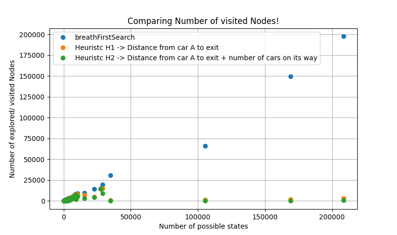
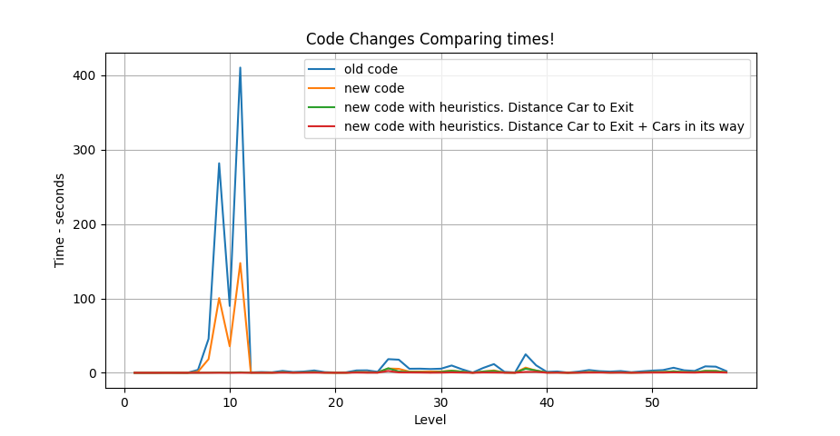
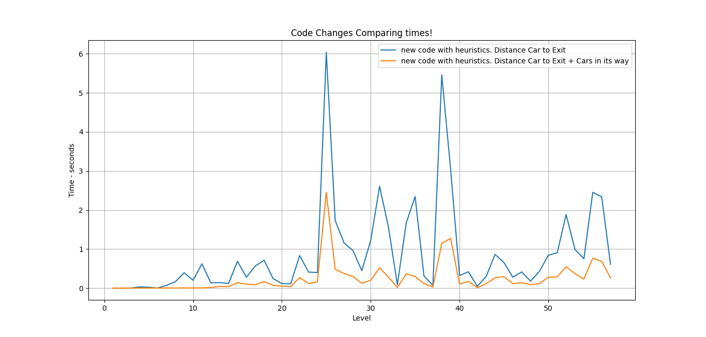

Graded 19.5 out of 20

# RUSH HOUR
Artificial Intelligence Project 2022 - Rush Hour

## Rules of the Game
[Explaination of the Rush Hour Puzzle Game](https://en.wikipedia.org/wiki/Rush_Hour_(puzzle)). Not only were there the basic rules of the Rush Hour Puzzle Game, but at certain intervals a random Car can move itself. Theese are described as Crazy Drivers. These serve to add complexity to the original puzzle.

## Algorithm Used

The algorithms used were [BreathSearch](https://en.wikipedia.org/wiki/Breadth-first_search), a [BestFirstSearch](https://en.wikipedia.org/wiki/Best-first_search) and the heuristics used for the BestFirstSearch were:
*  H1 -> Distance from Red Car to exit/Goal
*  H1 -> Distance from Red Car to exit/Goal + the Number of cars in its way

## Results

